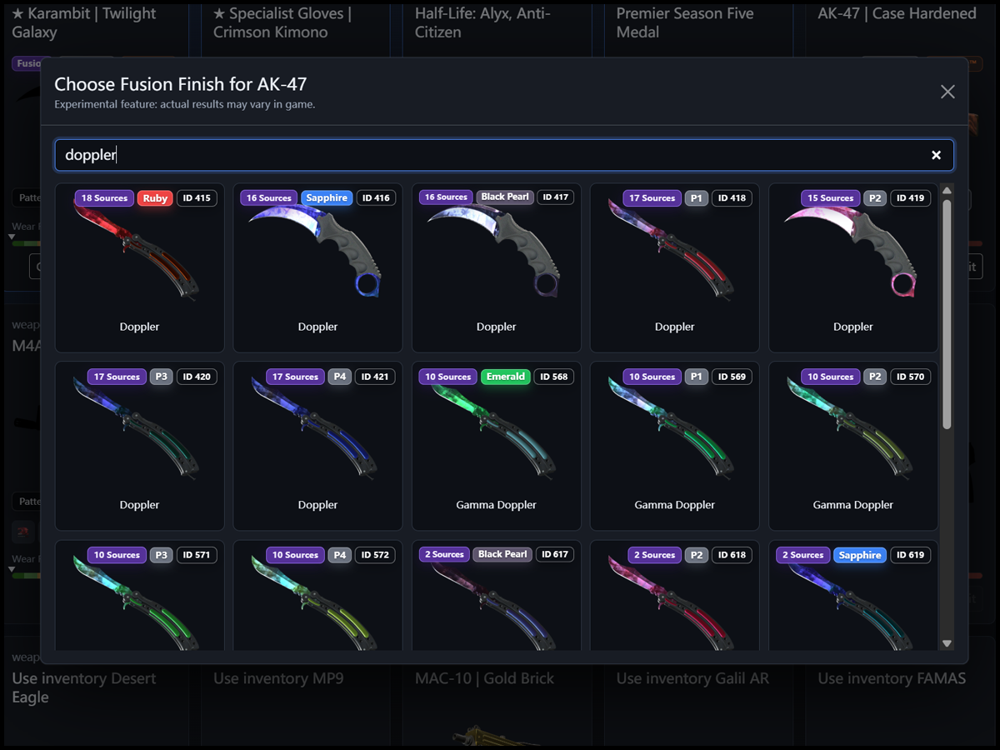
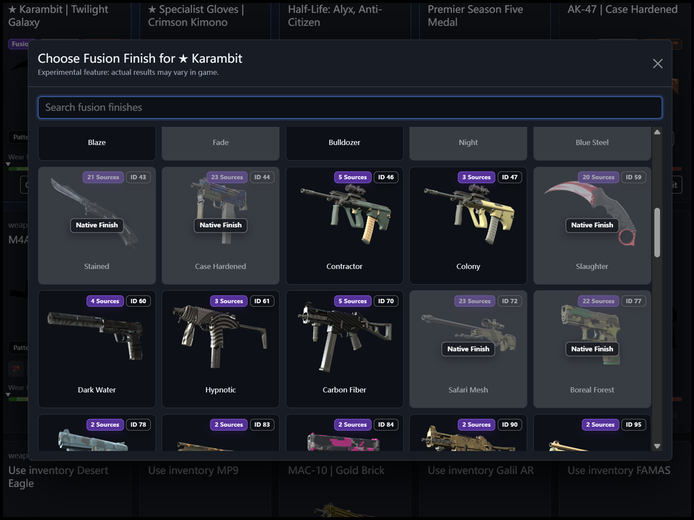

<p align="center">
    <a href="README.md"></a>
    <a href="README_cn.md"></a>
</p>

# CS2 WeaponPaints Loadout Manager

> A bilingual, Steamless loadout manager for private CS2 community servers.

> **This is a fork** of [wtf729/cs2-WeaponPaints-steamless-website](https://github.com/wtf729/cs2-WeaponPaints-steamless-website).
> It tracks upstream and adds a 3D placement bridge, a container deployment and
> environment-driven configuration. See [Fork additions](#fork-additions), or
> [Ajouts de ce fork](#ajouts-de-ce-fork) for the French version.

**No Steam login is required.** Players select or create a loadout with a Steam64 ID, then configure items directly from the website.

This project is intended for private servers and trusted player groups. It is not a complete public user-account system.

## Interface

<p align="center">
    
    
</p>

<p align="center">
    
    
</p>

<p align="center">
    
    
</p>

## Features

* Steam64 ID-based loadouts without Steam login
* Global, T-side, and CT-side editing modes
* Weapons, knives, gloves, agents, music kits, CS2 collectible pins, and weapon keychains
* Wear, pattern template, name tag, StatTrak™ status, and StatTrak™ kill count
* Five sticker slots per weapon, with fill-all, clear-all, and per-slot wear/position/scale/rotation settings
* Keychain pattern template and X/Y offset settings
* Searchable skin, sticker, keychain, music kit, and collectible pin pickers
* Searchable experimental skin fusion for applying a paint kit to a different weapon or knife
* Optional website password and per-loadout PIN protection
* Administrator mode for unrestricted loadout management and deletion
* English and Simplified Chinese UI
* Responsive dark interface with local fallback images

## Fork additions

### 3D placement bridge

Placing stickers and charms from a flat picker is guesswork. Rather than
rebuilding a 3D viewer, this fork bridges the site with an existing one through
CS2 inspect links.

Every weapon, knife and glove card carries a **3D** button. It opens a window
that offers two things: a link that opens that exact loadout in
[skincraft.gg](https://skincraft.gg), and a field to paste back the inspect link
the viewer produces. A *Paste from clipboard* button appears when the browser
allows reading the clipboard.

The round trip is:

1. Click **3D**, then **Open in SkinCraft**. The weapon arrives with its skin,
   wear, pattern, StatTrak, name tag, stickers and charm already applied.
2. Arrange everything in the viewer, then copy its inspect link.
3. Back on the site, paste the link and import. Run `!ws` again or respawn in
   game to apply it.

`class/inspect.php` encodes and decodes `CEconItemPreviewDataBlock` by hand, with
no dependency. Nothing that comes out of the decoder reaches the database
unchecked: the weapon has to match the card being edited, and paint, sticker and
charm ids are all cross-referenced against `data/*.json` before anything is
written.

The viewer refuses to be framed, so the preview cannot be embedded in the page;
the button opens it in a tab instead.

Fused paints are accepted on import as well: when skin fusion is enabled, a link
may carry a paint kit that does not belong to the weapon's own list.

### Known limitation: fine sticker placement

The *Keep the fine sticker placement* checkbox in the import window is **off by
default**, and should usually stay that way.

`SetStickers()` in the WeaponPaints plugin writes `sticker slot N schema = 0`
whenever a sticker has a non-zero offset. That discards the slot's base position
on the model, so every sticker collapses onto a common origin and ends up piled
in the middle of the weapon. Five identical stickers then look like a single one.

With the box unticked, sticker offsets are dropped on import and the stickers
fall back to their default positions, spread properly across the weapon. Charm
offsets are unaffected and are always kept.

Ticking the box preserves the offsets from the viewer, for whenever the plugin
gains the ability to honour them.

### Charms

Charm support requires the `weapon_keychain` column, which the site reads
unconditionally. Add it before deploying:

```sql
ALTER TABLE `wp_player_skins` ADD COLUMN `weapon_keychain` VARCHAR(64) NOT NULL DEFAULT '0;0;0;0;0';
```

Charm offsets are stored in world units, where a genuine inspect link routinely
carries values around 10, so they are not restricted to a unit range.

### Optional StatTrak counter lock

Players set their own StatTrak kill count by default. The counter is game state
the plugin maintains, so an editable field lets anyone claim a record they never
earned; on a public site you will probably want it locked.

Set `LOCK_STATTRAK_COUNT=true` to make it read-only. The check is enforced server
side, in the settings dialog and in the inspect link import alike: a forged
request or a link carrying its own count is discarded and the stored value is
kept. The StatTrak toggle itself stays editable either way.

### The accent follows the side

Editing the T side turns the interface orange, the CT side blue. Pages without a
side, such as the loadout list, keep the default blue.

The whole theme derives from two custom properties, `--primary` and
`--primary-rgb`, switched by a `data-team` attribute on the `html` element. Every
tint in the stylesheet now reads from them, so a third palette is a four-line
addition rather than a search through hard-coded colours.

### Sides only, no global tab

Loadouts are edited per side, T or CT. The former *Global* tab, which wrote to
both sides at once, is gone; an old link carrying `team=1` lands on the T side.

Music kits and collectible pins used to appear on that tab alone. They are stored
per side in the database, so they now show on both, like everything else.

### Container deployment

The repository ships a complete stack for running behind an existing reverse
proxy: an nginx + php-fpm `Dockerfile`, an `nginx.conf`, and a
`docker-compose.yml` whose Traefik labels, networks and database credentials all
come from a `.env` that git ignores.

```bash
cp .env.example .env   # then fill it in
docker compose config  # validates the file and shows the resolved labels
docker compose up -d --build
```

The image compiles `pdo_mysql`, `mbstring`, `curl` and OPcache, and fails the
build if any of them is missing. nginx logs to stdout and stderr so
`docker compose logs` shows them, and a health check exercises nginx and PHP
without touching the database.

### Environment-driven configuration

`class/config.php` reads every setting from the environment first and keeps its
former values as fallbacks, so a plain PHP hosting install still works by editing
that file while a container deployment needs no tracked secret at all.

### Fixes carried on top of upstream

* The StatTrak kill counter is read from `wp_player_skins` rather than the
  settings cache. It used to display as `0` for any counter the plugin had
  incremented in game, and saving wrote that zero straight back.

## Requirements

* PHP 8.0 or newer with Session and PDO MySQL support
* MySQL or MariaDB
* A working CS2 server with [WeaponPaints](https://github.com/Nereziel/cs2-WeaponPaints) connected to the same database

Enabling PHP cURL and mbstring is recommended. The database account should have `SELECT`, `INSERT`, `UPDATE`, `DELETE`, `CREATE`, and `ALTER` permissions.

## Installation

1. Copy the project into the document root or a website directory configured by your web server.

2. Edit `class/config.php`:

   ```php
   <?php
   define('DEFAULT_LANGUAGE', 'en'); // en or zh-CN
   define('SITE_NAME_EN', 'CS2 WeaponPaints Loadout Manager');
   define('SITE_NAME_ZH_CN', 'CS2 WeaponPaints 配置管理器');
   define('SITE_ACCESS_PASSWORD', ''); // Optional website password
   define('ADMIN_PASSWORD', ''); // Optional administrator password
   define('ENABLE_SKIN_FUSION', true); // Experimental cross-weapon paint combinations

   define('DB_HOST', '127.0.0.1');
   define('DB_PORT', '3306');
   define('DB_NAME', 'your_db_name');
   define('DB_USER', 'your_db_user');
   define('DB_PASS', 'your_db_password');
   ```

3. Open the website:

   ```text
   http://your-server/your-folder/
   ```

The website automatically creates its helper tables and adds missing helper columns when the configured database account has `CREATE` and `ALTER` permissions.

## Using the Website

1. Create a loadout with a Steam64 ID and an optional nickname.
2. Optionally enable a loadout PIN during creation.
3. Open the loadout and choose Global, T, or CT editing.
4. Select the desired items and use **Edit** for wear, pattern, StatTrak™, name tag, stickers, and keychain settings.
5. Use **Save** in an edit dialog to apply its settings. Sticker selection and sticker advanced settings use their own save flow.

Global mode writes supported team-based settings to both T and CT. Music kits are managed globally, while agents are selected separately for T and CT.

### Skin Fusion (Experimental)

Set `ENABLE_SKIN_FUSION` to `true`, open a weapon's **Skin** picker, then choose **Fusion Finish** to apply another paint kit to the current weapon or knife. The actual result depends on the installed WeaponPaints version and CS2 behavior.

### Loadout PINs

* A protected loadout asks for its PIN before opening.
* Successful verification is remembered for the current browser session.
* The PIN can be changed or disabled from the loadout's Basic Information section.
* PINs are stored as password hashes and cannot be read back as plain text.
* An unprotected loadout can be edited, and a visitor can enable a PIN for it. Use PIN protection before sharing the website.

### Administrator Mode

Set `ADMIN_PASSWORD` in `class/config.php` to enable the administrator button. An administrator can bypass loadout PINs, edit any loadout, change or clear its PIN, and delete loadouts.

**Loadouts can only be deleted in administrator mode.**

`SITE_ACCESS_PASSWORD` remains the first protection layer and is independent of administrator mode and loadout PINs.

## Updating CS2 Data

The updater refreshes skins, gloves, agents, music kits, stickers, keychains, collectible pins, and the fusion paint-kit catalog from [ByMykel/CSGO-API](https://github.com/ByMykel/CSGO-API). The generated `data/paint_kits_en.json` and `data/paint_kits_zh-CN.json` files preserve paint-kit source names and images used by the fusion picker.

### First Run

Right-click the project folder and copy its path. Open Command Prompt or PowerShell, then change to the copied folder path:

```shell
cd "PROJECT FOLDER PATH"
```

Run the full update:

```bash
php tools/update_cs2_data.php
```

Preview without writing output files:

```bash
php tools/update_cs2_data.php --dry-run
```

Update only skins, gloves, and the fusion paint-kit catalog:

```bash
php tools/update_cs2_data.php --only=skins
```

Downloaded source files are cached in `data/.source_cache/`. A valid cache is reused without requesting GitHub again. Delete the relevant cache file when you want to fetch fresh upstream data. Existing output files are backed up in `data/backups/` before replacement.

If GitHub returns HTTP 429, wait before retrying. Failed downloads do not overwrite valid cached or generated data.

## Database

The website uses the existing WeaponPaints tables, including:

* `wp_player_skins`
* `wp_player_knife`
* `wp_player_gloves`
* `wp_player_agents`
* `wp_player_music`
* `wp_player_pins`

It also creates:

* `wp_presets` for the loadout list, nicknames, and hashed loadout PINs
* `wp_skin_settings_cache` for remembering per-skin website settings

## Security

Use HTTPS when enabling passwords or PINs. Website-password, administrator-password, and loadout-PIN failures are rate limited by client IP. By default, five failures within 30 minutes cause a one-minute lock; these values can be changed with the `AUTH_RATE_LIMIT_*` settings in `class/config.php`.

State-changing requests are protected by CSRF token validation.

This project is designed for private or trusted environments. Removing Steam authentication makes access convenient, but it does not provide identity verification.

## Ajouts de ce fork

Version française de la section [Fork additions](#fork-additions).

### Pont de placement 3D

Placer des stickers et un pendentif depuis une liste plate revient à travailler à
l'aveugle. Plutôt que de reconstruire un visualiseur 3D, ce fork relie le site à
un visualiseur existant par les liens d'inspection CS2.

Chaque carte d'arme, de couteau et de gants porte un bouton **3D**. Il ouvre une
fenêtre proposant deux choses : un lien qui ouvre ce loadout précis sur
[skincraft.gg](https://skincraft.gg), et un champ où recoller le lien
d'inspection que le visualiseur produit. Un bouton *Coller depuis le
presse-papier* apparaît quand le navigateur autorise la lecture du presse-papier.

Le cycle complet :

1. Cliquer sur **3D**, puis sur **Ouvrir dans SkinCraft**. L'arme arrive avec son
   skin, son usure, son motif, son StatTrak, son nom personnalisé, ses stickers
   et son charm déjà appliqués.
2. Tout disposer dans le visualiseur, puis copier son lien d'inspection.
3. De retour sur le site, coller le lien et importer. En jeu, refaire `!ws` ou
   respawn pour que ce soit appliqué.

`class/inspect.php` encode et décode `CEconItemPreviewDataBlock` à la main, sans
aucune dépendance. Rien de ce qui sort du décodeur n'atteint la base sans
contrôle : l'arme doit correspondre à la carte en cours d'édition, et les
identifiants de peinture, de stickers et de charm sont tous recoupés avec
`data/*.json` avant la moindre écriture.

Le visualiseur refuse d'être affiché en iframe, l'aperçu ne peut donc pas être
intégré à la page ; le bouton l'ouvre dans un onglet.

Les peintures fusionnées sont acceptées à l'import : quand la fusion de skins est
activée, un lien peut porter un paint kit qui n'appartient pas à la liste propre
de l'arme.

### Limite connue : le placement fin des stickers

La case *Garder le placement fin* de la fenêtre d'import est **décochée par
défaut**, et il vaut mieux la laisser ainsi.

`SetStickers()`, dans le plugin WeaponPaints, écrit `sticker slot N schema = 0`
dès qu'un sticker a un décalage non nul. Cela supprime la position de base de
l'emplacement sur le modèle : tous les stickers retombent alors sur une origine
commune et s'entassent au milieu de l'arme. Cinq stickers identiques finissent
par n'en former qu'un seul à l'œil.

Case décochée, les décalages sont abandonnés à l'import et les stickers
reprennent leurs positions par défaut, correctement répartis sur l'arme. Les
décalages du charm ne sont pas concernés et sont toujours conservés.

Cocher la case préserve les décalages du visualiseur, pour le jour où le plugin
saura les respecter.

### Pendentifs

Le support des charms exige la colonne `weapon_keychain`, que le site lit sans
condition. À ajouter avant tout déploiement :

```sql
ALTER TABLE `wp_player_skins` ADD COLUMN `weapon_keychain` VARCHAR(64) NOT NULL DEFAULT '0;0;0;0;0';
```

Les décalages de charm sont exprimés en unités de monde, où un lien d'inspection
réel porte couramment des valeurs de l'ordre de 10 : ils ne sont donc pas
restreints à un intervalle unitaire.

### Verrou optionnel du compteur StatTrak

Par défaut, chaque joueur règle lui-même son nombre de frags StatTrak. Ce
compteur est un état de jeu que le plugin entretient : un champ modifiable permet
donc de s'attribuer un palmarès qu'on n'a jamais fait, et sur un site public tu
voudras probablement le verrouiller.

Passe `LOCK_STATTRAK_COUNT=true` pour le mettre en lecture seule. Le contrôle est
appliqué côté serveur, dans la fenêtre de réglages comme à l'import d'un lien
d'inspection : une requête forgée ou un lien portant son propre compteur est
écarté et la valeur enregistrée est conservée. L'interrupteur StatTrak lui-même
reste modifiable dans les deux cas.

### La couleur suit le camp

Éditer le camp T passe l'interface en orange, le camp CT en bleu. Les pages sans
camp, comme la liste des loadouts, gardent le bleu par défaut.

Tout le thème découle de deux propriétés personnalisées, `--primary` et
`--primary-rgb`, basculées par un attribut `data-team` sur l'élément `html`.
Chaque teinte de la feuille de style les lit désormais, si bien qu'une troisième
palette tient en quatre lignes au lieu d'une chasse aux couleurs codées en dur.

### Uniquement T et CT, plus d'onglet global

Les loadouts s'éditent par camp, T ou CT. L'ancien onglet *Global*, qui écrivait
dans les deux à la fois, a disparu ; un ancien lien portant `team=1` arrive du
côté T.

Les kits musicaux et les pin's n'apparaissaient que sur cet onglet. Ils sont
stockés par camp en base, ils s'affichent donc désormais des deux côtés, comme le
reste.

### Déploiement en conteneur

Le dépôt fournit une pile complète pour tourner derrière un reverse proxy
existant : un `Dockerfile` nginx + php-fpm, un `nginx.conf`, et un
`docker-compose.yml` dont les labels Traefik, les réseaux et les identifiants de
base viennent tous d'un `.env` ignoré par git.

```bash
cp .env.example .env   # puis le remplir
docker compose config  # valide le fichier et affiche les labels résolus
docker compose up -d --build
```

L'image compile `pdo_mysql`, `mbstring`, `curl` et OPcache, et fait échouer la
construction si l'une manque. nginx journalise sur stdout et stderr pour que
`docker compose logs` les montre, et un contrôle de santé éprouve nginx et PHP
sans toucher à la base.

### Configuration par l'environnement

`class/config.php` lit chaque réglage depuis l'environnement en priorité et
conserve ses anciennes valeurs en repli : une installation classique sur
hébergement PHP fonctionne toujours en éditant ce fichier, tandis qu'un
déploiement en conteneur n'a besoin d'aucun secret dans un fichier suivi.

### Correctifs apportés par-dessus l'upstream

* Le compteur de frags StatTrak est lu depuis `wp_player_skins` et non depuis le
  cache de réglages. Il s'affichait à `0` pour tout compteur incrémenté en jeu
  par le plugin, et l'enregistrement gravait ce zéro en base.

## Credits

* [Nereziel/cs2-WeaponPaints](https://github.com/Nereziel/cs2-WeaponPaints) for the WeaponPaints plugin and original web workflow
* [ByMykel/CSGO-API](https://github.com/ByMykel/CSGO-API) for the CS2 item data used by the updater
