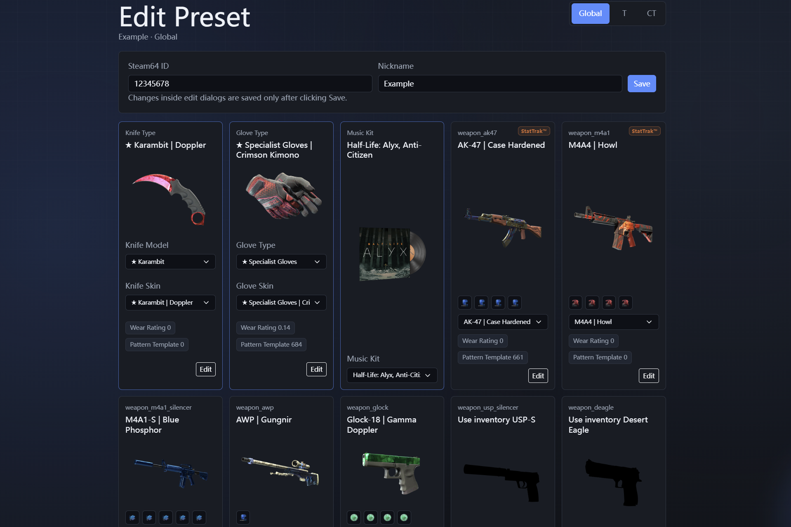
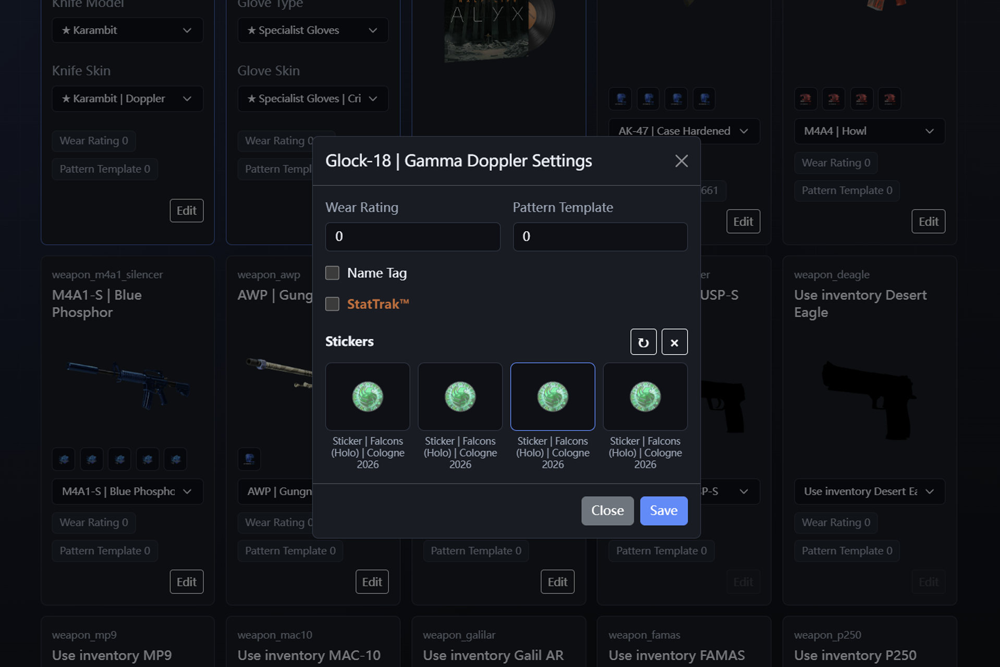
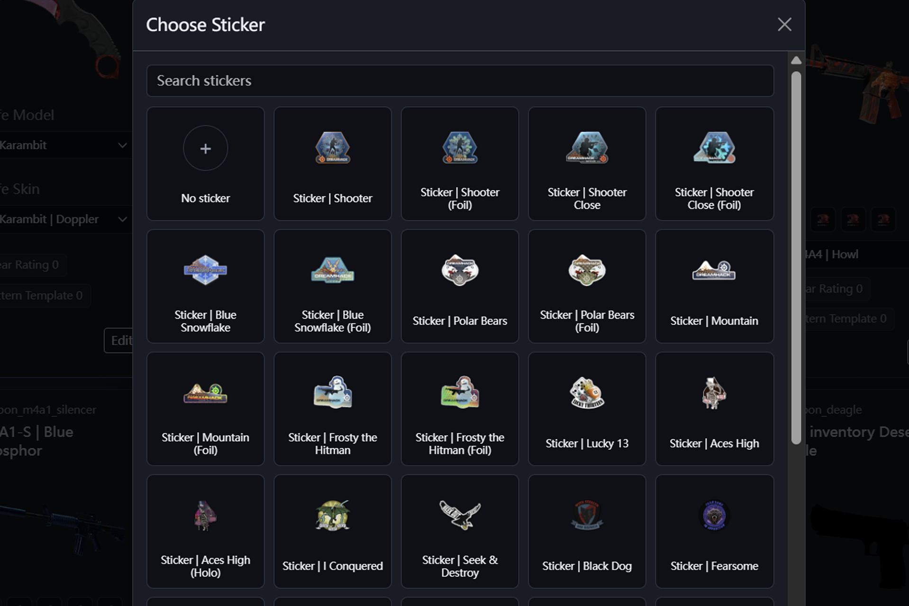
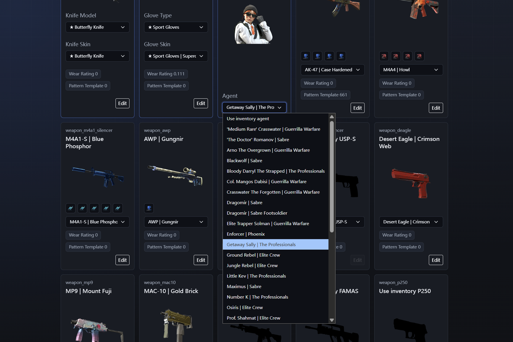

<p align="center">
    <a href="README.md">
        
    </a>
    <a href="README_cn.md">
        
    </a>
</p>

# CS2 WeaponPaints 预设管理网站

> 面向CS2私人社区服的WeaponPaints皮肤预设管理面板。
> 无需Steam登录，只需Steam64 ID，即可写入对应数据库配置。

## 制作目的

原版WeaponPaints网站通过Steam登录识别玩家，然后把玩家选择的皮肤配置写入WeaponPaints使用的数据库。

登录Steam账号有时会产生安全顾虑以及网络问题，因此我做了这个让玩家自行输入Steam64 ID的网站。

由于移除了Steam登录，它更适合私人CS2社区服和可信任的小型玩家群体。玩家可以直接通过输入Steam64 ID创建或选择预设。

相比原网页，本项目增加了预设系统、网站访问密码、名称标签、StatTrak™、贴纸编辑、音乐盒选择、探员选择、加载图片兜底和CS2皮肤数据更新工具。

**本项目不需要Steam登录。**

这也意味着它不是一个面向公开网站的账号安全系统。只要能访问网站，用户就可以通过输入Steam64 ID修改预设。因此建议配合HTTPS、网站访问密码使用。

## 界面

<p align="center">
    
    
</p>

<p align="center">
    
    
</p>

## 功能

### 预设管理

* 通过 Steam64 ID 管理预设，不需要 Steam 登录
* 支持给预设添加备注名，方便识别玩家
* 支持全局、T 阵营、CT 阵营三种编辑模式

### 皮肤编辑

* 支持武器、匕首、手套、探员、音乐盒
* 支持磨损、模板、StatTrak™、名称标签
* 支持武器贴纸选择，并提供一键覆盖和一键清除

### 网站和数据

* 支持设置网站访问密码
* 支持电脑和手机访问
* 支持英文和简体中文界面
* 使用本地占位图，远程图片加载成功后自动替换
* 使用来自`steamstatic.com`的图片，以确保大部分地区可以加载图片
* 提供基于 [ByMykel/CSGO-API](https://github.com/ByMykel/CSGO-API) 的CS2皮肤数据更新工具

## 致谢

本网站基于原WeaponPaints网页的数据库工作流和使用方式进行重写。面向私人服务器场景，移除了Steam登录，并增加了预设管理、更多饰品编辑、语言切换和数据更新等功能。

感谢：

* [Nereziel/cs2-WeaponPaints](https://github.com/Nereziel/cs2-WeaponPaints)：提供CS2 WeaponPaints插件和原始网页工作流。
* [ByMykel/CSGO-API](https://github.com/ByMykel/CSGO-API)：提供本项目更新工具使用的CS2饰品数据。

## 支持语言

当前网站支持：

* English (`en`)
* 简体中文 (`zh-CN`)

网站界面和饰品数据都支持语言切换。饰品名称和相关CS2数据来自 [ByMykel/CSGO-API](https://github.com/ByMykel/CSGO-API)。

目前该数据源提供英文和简体中文数据。如果以后数据源或本项目增加更多语言，也可以继续扩展。

## 运行要求

- 支持PHP的Web服务器
- 已经搭建好的数据库
- 已经搭建好的CS2社区服，并且 [WeaponPaints](https://github.com/Nereziel/cs2-WeaponPaints) 已连接到同一个数据库

## 快速开始

1. 将本项目文件夹复制到你的Web服务器目录。

   XAMPP 示例：

   ```text
   ...\xampp\htdocs\cs2-WeaponPaints-steamless-website
   ```

2. 编辑 `class/config.php`，设置网页的默认语言以及你的数据库信息。

   ```php
   <?php
   define('DEFAULT_LANGUAGE', 'zh-CN'); // 可用值：en, zh-CN
   define('SITE_ACCESS_PASSWORD', ''); // 填写密码后启用访问保护
   define('DB_HOST', '127.0.0.1');
   define('DB_PORT', '3306');
   define('DB_NAME', 'your_db_name');
   define('DB_USER', 'your_db_user');
   define('DB_PASS', 'your_db_password');
   ```

3. 访问网站。

   ```text
   http://your-server/your-folder/
   ```

4. 如果设置了 `SITE_ACCESS_PASSWORD`，首次访问时需要输入访问密码。

5. 使用Steam64 ID和可选备注名创建预设。

6. 按需选择和编辑皮肤配置。

## 更新 CS2 数据

运行命令行更新工具：

```bash
php tools/update_cs2_data.php
```

只预览，不写入文件：

```bash
php tools/update_cs2_data.php --dry-run
```

只更新皮肤和手套数据：

```bash
php tools/update_cs2_data.php --only=skins
```

更新工具会在以下目录创建备份：

```text
data/backups/
```

## 武器排序

网站和更新工具共用以下文件决定武器卡片顺序：

```text
class/weapon_order.php
```

如果你想调整网页上的武器卡片顺序，可以编辑这个文件。

匕首相关武器仍然可能出现在 `weapon_order.php` 中用于数据排序，但网页会通过专门的匕首卡片显示它们。

## 数据表

本项目会读写 WeaponPaints 的相关表：

* `wp_player_skins`
* `wp_player_knife`
* `wp_player_gloves`
* `wp_player_agents`
* `wp_player_music`

除此之外，网站还会自动创建两个仅供网站使用的辅助表。如果数据库用户有对应权限，它们会在访问网站时自动创建：

* `wp_presets`：保存网站预设列表和备注名
* `wp_skin_settings_cache`：保存网站侧的单个皮肤设置，例如磨损、模板、StatTrak™、名称标签，方便切换皮肤后继续记住这些设置

网站会先读取 `wp_presets`，再根据选中的Steam64 ID读取和写入WeaponPaints的数据。

## 皮肤设置模式

- 全局模式：同时应用到 T 和 CT
- T 阵营模式：只编辑 T 阵营配置
- CT 阵营模式：只编辑 CT 阵营配置

## 保存

- 下拉框选择会立即保存
- 详细设置需要点击弹窗中的保存按钮才会保存，例如磨损、StatTrak™、名称标签和贴纸

## 说明

* 贴纸编辑只适用于武器皮肤。大多数武器有4个默认贴纸槽，拥有5个默认贴纸槽的武器会显示5个槽位。
* 网站会优先显示本地占位图，远程图片加载成功后再自动替换。
* 饰品数据存放在`data/`目录中，并通过`tools/update_cs2_data.php`维护。
* 钥匙串和收藏品数据已经预留，用于未来功能扩展。

## 安全说明

本项目面向私人或可信任服务器环境。
